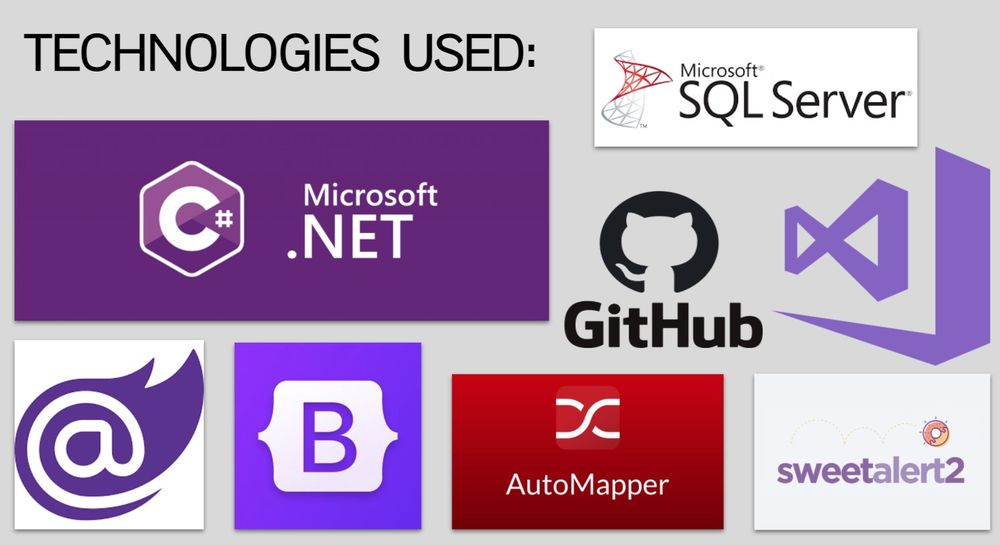
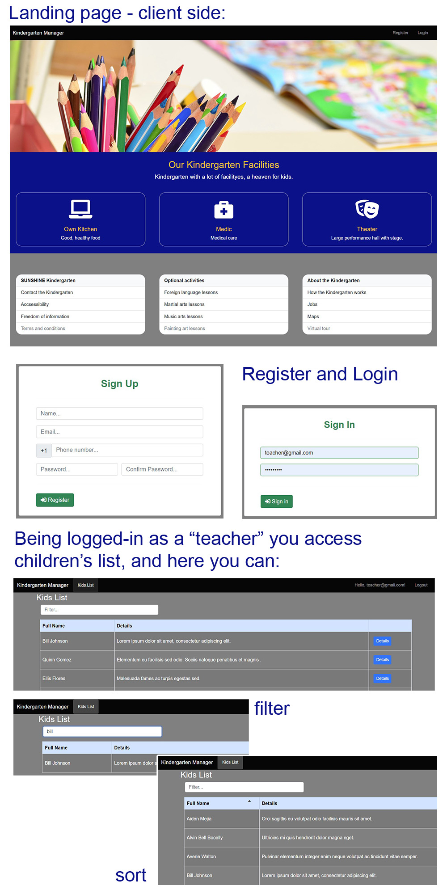
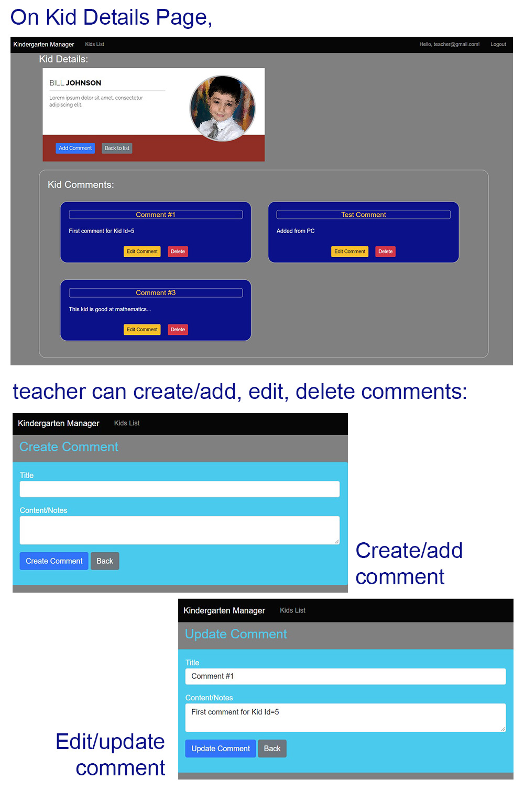
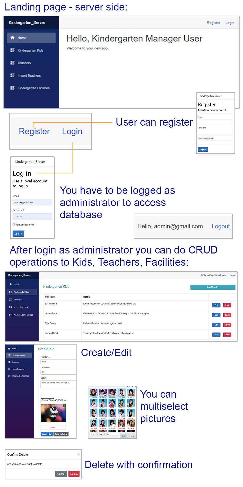
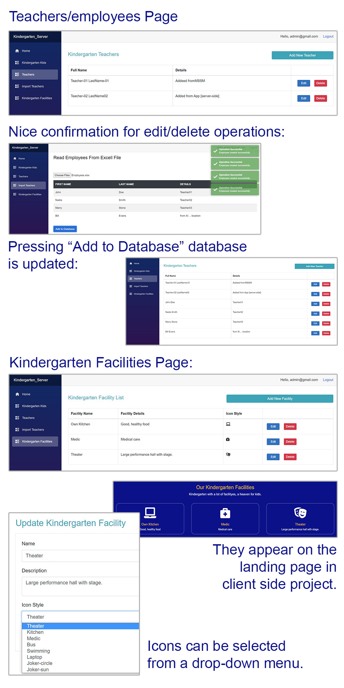

# KINDERGARTEN MANAGER

**Single/pet project:**  1 programmer \* (6 sprints)  >> cca 30 coding hours

**Technology/Language used:**

* C#, Blazor both Server Side & Client Side (WebAssembly), Microsoft SQL Server [backend]
* Bootstrap, HTML, CSS [frontend]
* Visual Studio [IDE]
* Git, GitHub, Asana [versioning, planning]

  

## Description:
**Kindergarten Manager** is a web application ment for kindergarten administratore and teachers, helping them to:
* Present some kindergarten info [for visitors]
* Keep track of children, parents and teachers [for admins].
* It starts from the requirements of the principal of a kindergarten.

* It has a part where the administrators will work - which is Blazor_Server App
* It has a part that will be accessed by teachers and parents - which is Blazor_WebAssembly + API
  

## CLIENT Side Part (WASM): Usage and Features samples:
* Visitors/parents can view kindergarten facilities and other informations.
* Teachers, being logged-in can access children's list, where they can sort and filter records.

* Teachers can view details about a kid.
* Teachers can view, create, edit and delete comments (notes) referring each child (kid).

  

## SERVER Side Part: Usage and Features samples:
* This is the kindergarten administrators part of the app.
* It uses Blazor Server hosted technology, which is more secure.
* After logging-in as administrator, you can view, create, update and delete records in kids, teachers and facilities databases.
* You can select one or multiple images for a kid.

* Colorfull popup notifications confirm every successful or unsuccessful operation (using Toastr)
* Import records from excell files (using EPPlus library)
* Select AwesomeFonts icons from drop-down mwnu.

